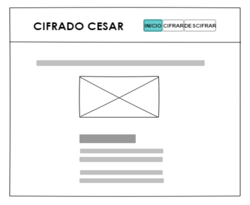
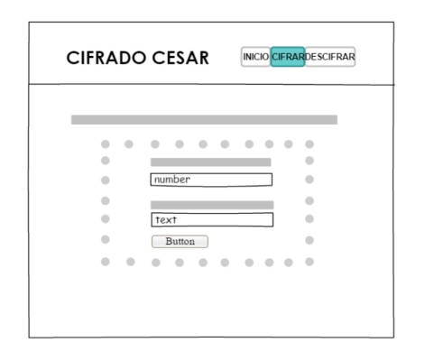
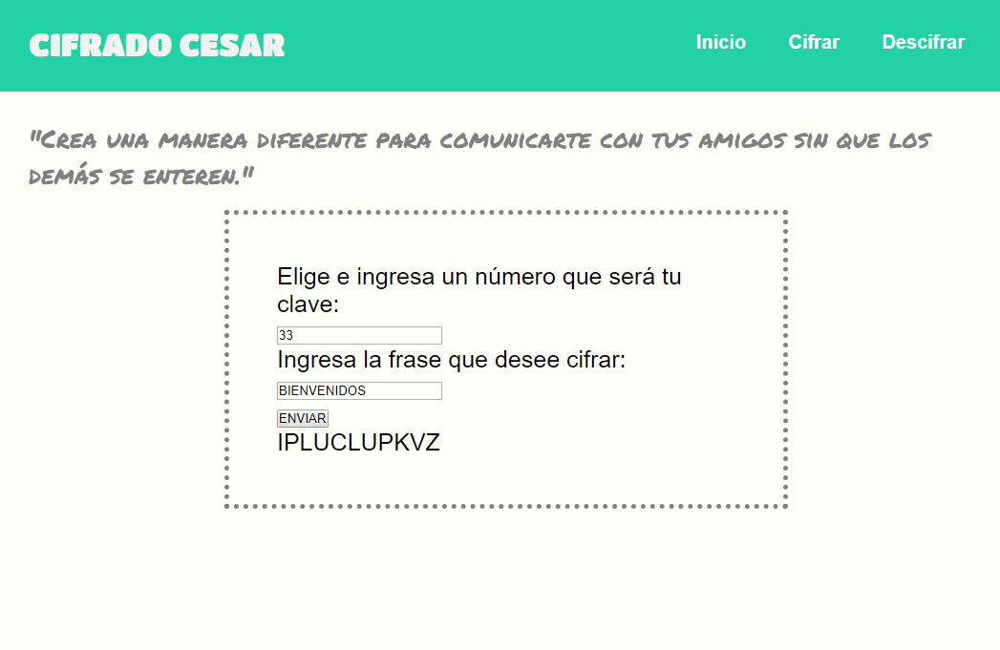

# Cifrado César

*"Crea una manera diferente para comunicarte con tus amigos sin que los demás se enteren."*
 
Este proyecto le permite al usuario crear una manera diferente para comunicarte 
con tus amigos sin que los demás se enteren y protege la información , ya que 
si los mensaje cifrados son interceptados, no podrán ser leídos.
Cifrado Cesar esta enfocado al público en general ya que todos tenemos algo 
importante o secreto que compartir entre amigos, familiares y hasta en negocios. 

Ejemplo:
Está proxima una reunión con un socio y vas a entregar la información que es 
importante para la empresa, pero no debe filtrarse a la competencia.
Con Cifrado Cesar eso no pasará te brindará la seguridad que necesitas, 
ya que solo tú y tu socio entenderán el mensaje 😎.

## Introducción

El [cifrado César](https://en.wikipedia.org/wiki/Caesar_cipher) es uno de los
primeros métodos de cifrado conocidos históricamente. Es un tipo de cifrado por
sustitución en el que una letra en el texto original es reemplazada por otra
letra que se encuentra un número fijo de posiciones más adelante en el alfabeto.

El emperador Julio César lo usaba para enviar órdenes a sus generales en los
campos de batalla, es una de las técnicas más simples y más usadas para cifrar
un mensaje.

Por ejemplo si usáramos un desplazamiento de 3:

* Alfabeto sin cifrar: A B C D E F G H I J K L M N O P Q R S T U V W X Y Z
* Alfabeto cifrado: D E F G H I J K L M N O P Q R S T U V W X Y Z A B C

Actualmente todos los cifrados de sustitución alfabética simple, se descifran
con facilidad y en la práctica no ofrece mucha seguridad en la comunicación,
pero el cifrado César muchas veces puede formar parte de sistemas más complejos
de codificación, como el cifrado Vigenère, e incluso tiene aplicación en el
sistema ROT13.

## Objetivos

El objetivo fundamental del proyecto es ofrecer seguridad y privacidad al usuario 
cuando quiera enviar mensajes importantes.
Cifrar el mensaje significa alterarlos, mediante el uso 
de una clave, de modo que no sea entendible para quienes no tengan dicha clave. 
Luego en el proceso de descifrado, aquellos que sí tengan la clave podrán 
utilizarla para obtener la información original. 

## Primeros Pasos
 
 

## Instrucciones
1. El usuario puede seleccionar cifrar o descifrar el mensaje que desee.

2. Si el usuario escoge cifrar primero debe ingresa el número que desee ya que ese número funcionará como clave.
   Luego debe ingresar la frase para que cambie(cifrado) y click en enviar.

3. Si el usuario escoge descifrar debe ingresar su clave. Luego debe ingresar el texto cifrado y click en enviar para obtener la frase original(descifrado).

***

